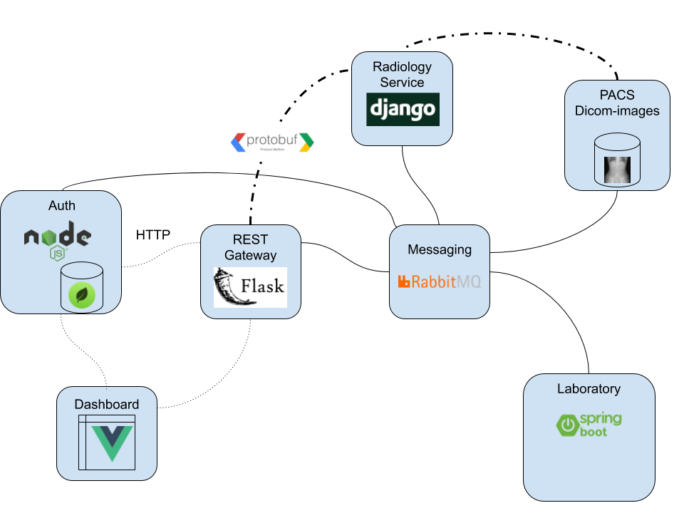

# microservices in medicine

## microservices design philosophy
1. microservices are small. Some microservices run 1000 of them
2. Independently deployable: replace x by y with changing anything else
3. Successful microservice architecture should implement DDD (Domain Driven Desing) 
4. Handling microservices depends on logging 
5. In microservices there is no too much testing, most of the testing is done by unitesting. Manual testing is not possible because the systems is highly random
6. Microservices can be seen as an object and pull ideas from OOP:
    1. delegation!
    2. hide data
    3. do things!
7. You should not know who is talking to? no IP or names!
8. BASIC RULE: replacement principle. YOU SHOULD BE ABEL TO RADICALLY CHANGE THE IMPLEMENTATION OF A CLASS WITHOUT IMPATNING THE CLIENTS.
9. Bounded context: a way of model business. Example
    1. context of the store:
        1. books: a name author
        2. cashier...
    2. context warehouse:
        1. books: how heavy, size
    3. Context microservices are isolated!!! they connected via ports. 
10. Ubiquity languages which is a kinda language. translating protocols
11. UI: the agent architecture.
    1. each view has it own controller database and private communication API
12. Communication. No SOAP, No REST. Nothing CRUD! accessing data! Therefore RabbitMQ or ZeroMQ are good choices
--------

## microservices in healthcare

------
1. DDD is the ideal software design paradigm that fits the nature of microservices very well
2. The model should reflect the structure of the organization
3. Microservices focus on security since all calls implement authentification checks in the destination service.
